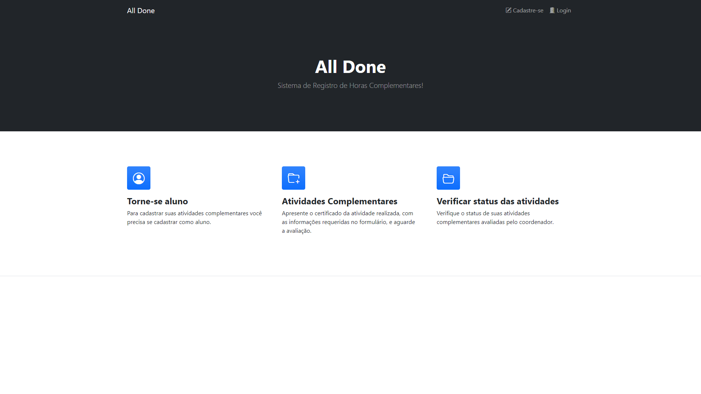
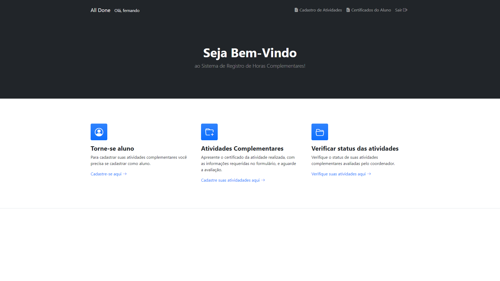
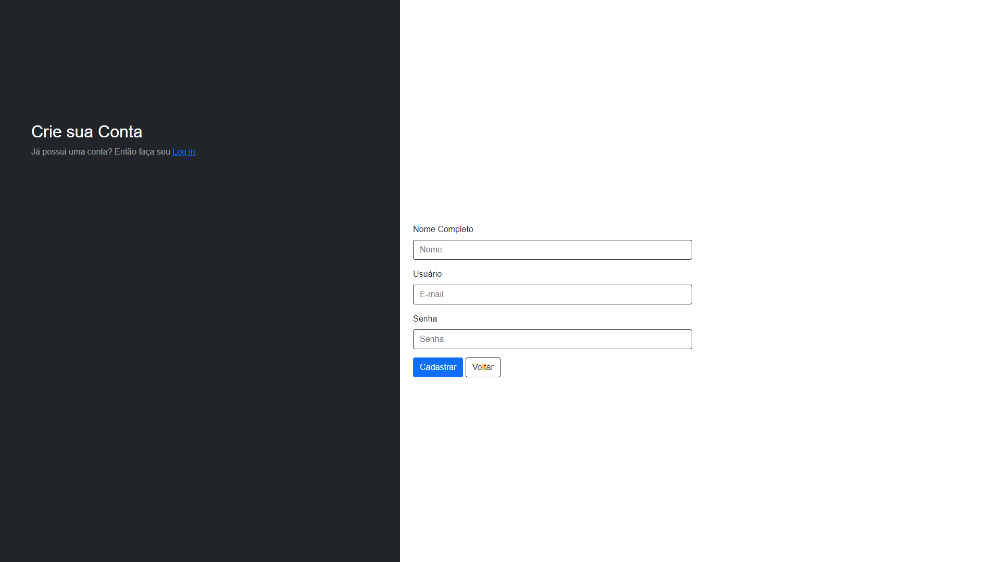
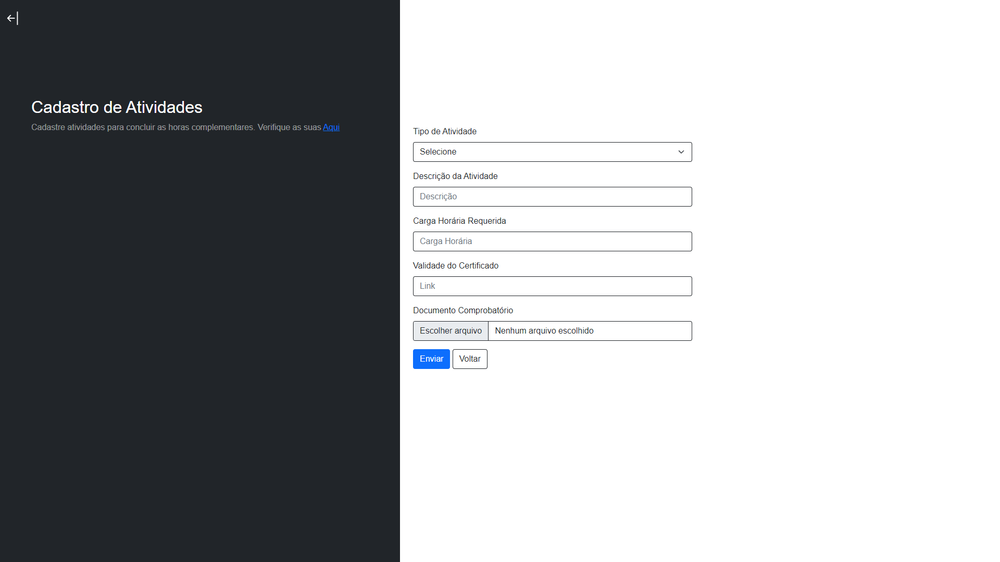
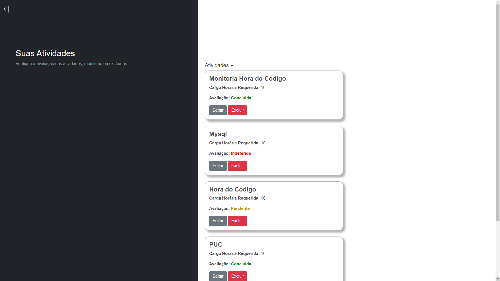
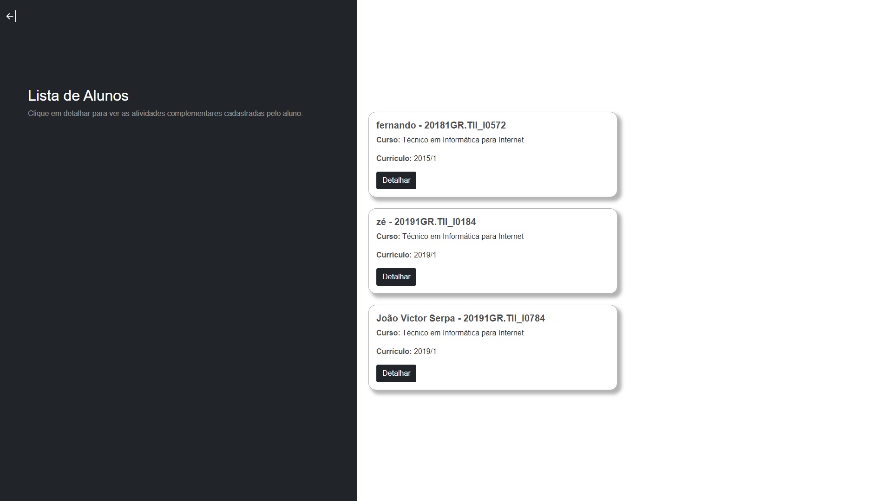
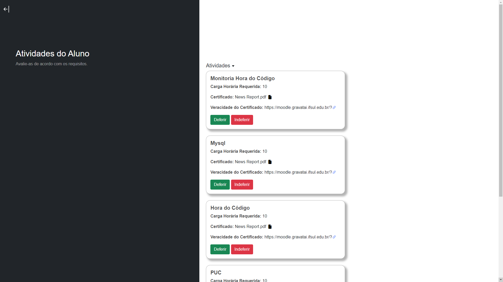

# ALL DONE - Plataforma de Apresentação e Avaliação de Horas Complementares

---

## Visão Geral

O ALL DONE é uma plataforma web desenvolvida como Trabalho de Conclusão de Curso
(TCC) no curso Técnico em Informática para Internet do IFSul - Campus Gravataí.

O sistema tem como objetivo digitalizar e otimizar o processo de apresentação,
avaliação e controle de atividades complementares, substituindo processos físicos
ou formulários isolados por uma solução centralizada, organizada e rastreável.

---

## Problema Abordado

O gerenciamento de atividades complementares em instituições de ensino costuma ser:

- Burocrático  
- Fragmentado  
- Dependente de documentos físicos ou formulários simples  
- Pouco transparente para alunos e coordenação  

O ALL DONE foi projetado para oferecer um fluxo digital estruturado, com controle
de acesso por perfil e organização das informações acadêmicas.

---

## Perfis de Usuário

O sistema utiliza controle de acesso baseado em perfis, garantindo que cada
usuário tenha acesso apenas às funcionalidades relacionadas ao seu papel.

### Aluno
- Cadastro de atividades complementares
- Envio de comprovantes
- Acompanhamento do status das avaliações

### Coordenador
- Avaliação das atividades enviadas pelos alunos
- Deferimento ou indeferimento das atividades
- Controle do fluxo de validação

### Secretaria
- Consulta de alunos que concluíram a carga horária complementar
- Apoio ao registro acadêmico institucional

### Administrador
- Cadastro e gerenciamento de usuários
- Cadastro de cursos e currículos
- Definição dos tipos de atividades válidas por currículo

---

## Arquitetura da Aplicação

A aplicação segue uma arquitetura web tradicional, composta por:

### Front-end
- Interface acessada via navegador
- Responsável pela interação com o usuário

### Back-end
- Implementação da lógica do sistema
- Gerenciamento de autenticação, permissões e regras de negócio

### Banco de Dados
- Armazenamento relacional das informações
- Estrutura baseada na modelagem acadêmica do domínio

---

## Metodologia de Desenvolvimento

O desenvolvimento do projeto seguiu as seguintes etapas:

1. Análise de Requisitos  
   - Levantamento de requisitos funcionais e não funcionais  
   - Definição das permissões por perfil  

2. Modelagem  
   - Diagrama de Caso de Uso  
   - Diagrama Entidade-Relacionamento (ER)  

3. Definição Tecnológica  
   - Seleção de tecnologias consolidadas para desenvolvimento web  

4. Implementação  
   - Desenvolvimento incremental  
   - Integração entre front-end, back-end e banco de dados  

---

## Modelagem de Dados

O banco de dados relacional foi projetado para representar o fluxo completo das
atividades complementares, incluindo entidades como:

- Usuários e perfis
- Cursos e currículos
- Alunos
- Tipos de atividades complementares
- Atividades cadastradas
- Histórico de ações sobre as atividades

---

## Funcionalidades Implementadas

### Autenticação
- Cadastro de usuários
- Login com controle de sessão

### Funcionalidades do Aluno
- Cadastro, edição e exclusão de atividades
- Visualização do status das atividades submetidas

### Funcionalidades da Coordenação
- Listagem de alunos
- Avaliação das atividades cadastradas
- Deferimento ou indeferimento das solicitações

### Funcionalidades da Secretaria
- Consulta de alunos com carga horária complementar concluída

### Funcionalidades Administrativas
- Cadastro de cursos
- Cadastro de currículos
- Definição de atividades válidas por currículo
- Gerenciamento de usuários e perfis

---

## Telas do Sistema

- As imagens das telas do sistema disponiveis neste repositorio correspondem aalgumas telas
desenvolvidas e documentadas no relatorio final do TCC:

### Página Inicial

### Login

### Página Principal

### Cadastro de Usuário

### Cadastro de Atividade

### Edição de Atividade

### Aluno - Verificação de Atividades

### Atividades Deferidas do Aluno

### Lista de Alunos

### Coordenador - Avaliação de Atividades

---

## Tecnologias Utilizadas

### Front-end
- HTML
- CSS
- JavaScript
- Bootstrap
- jQuery

### Back-end
- PHP

### Banco de Dados
- MySQL

### Servidor
- Apache

---

## Contexto Acadêmico

- Curso: Técnico em Informática para Internet  
- Instituição: Instituto Federal de Educação, Ciência e Tecnologia Sul-rio-grandense  
- Campus: Gravataí  
- Autor: João Victor Serpa Dorneles  
- Orientador: Prof. Me. Douglas Kellermann  
- Ano: 2022
